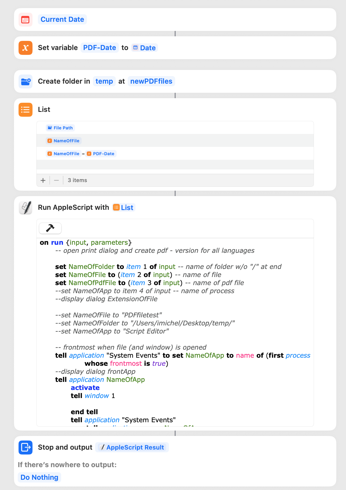

# Exemple with system events and shortcuts

The events open successively printer sheet, Save pdf sheet, folder sheet and optionally replace sheet (if pdf file exists). Using index (and not name), the script is ready for most languages.

Shortcuts actions before prepare inputs...

Screenshots to

The script inside “run AppleScript” action [see here](https://github.com/dev-xiligroup/Some-notes-about-Applescript-in-Sequoia/blob/main/SavePDFwithSystemEvents/Run_Script.applescript)